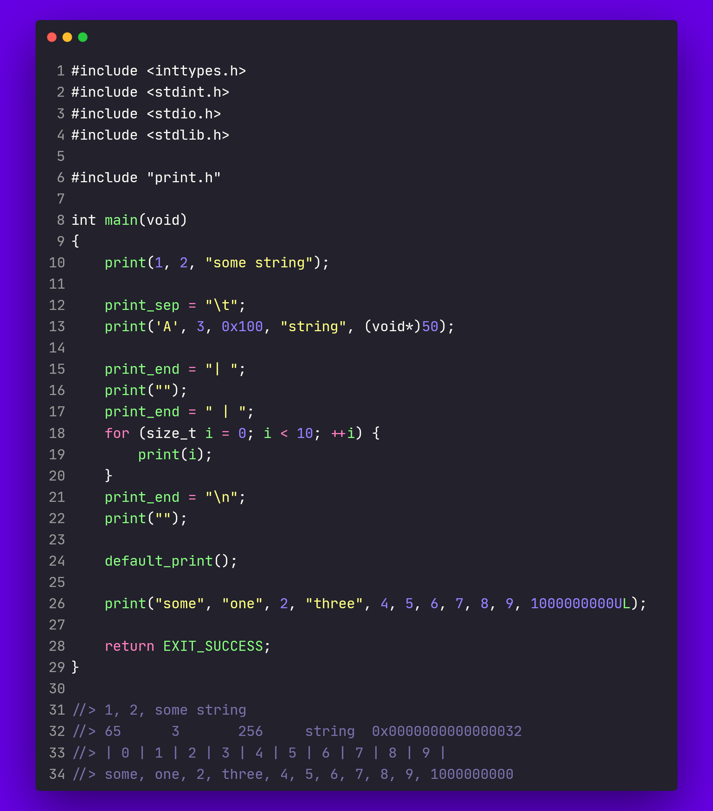

<div align="center">
  <h1>Print</h1>

  <p>
    Implementation of the "print" function in c as in python
  </p>

<!-- Badges -->
<p>
  <a href="https://github.com/Qu1nel/Print/graphs/contributors">
    
  </a>
  <a href="https://github.com/Qu1nel/Print/commits/main">
    
  </a>
  <a href="https://github.com/Qu1nel/Print/network/members">
    
  </a>
  <a href="https://github.com/Qu1nel/Print/stargazers">
    
  </a>
  <a href="https://github.com/Qu1nel/Print/issues/">
    
  </a>
</p>

<p>
  <a href="https://github.com/Qu1nel/Print/releases/">
    
  <a>
  <a href="https://github.com/Qu1nel/Print/blob/main/LICENSE">
    
  </a>
</p>

<h4>
  <a href="#overview">Overview</a>
  <span> · </span>
  <a href="#documentation">Documentation</a>
  <span> · </span>
  <a href="https://github.com/Qu1nel/Print/issues/">Report Bug</a>
  <span> · </span>
  <a href="https://github.com/Qu1nel/Print/issues/">Request Feature</a>
</h4>
</div>

<br />

## Overview

<details>
  
</details>

## Installation

Requirements: >=gcc 10.0, >=clang 13.0.0

The static library is built using make. (clang for `Pring.lib`)

```bash
make build
```

For testing and preview purposes:

```bash
make build
make example
./main
```

## Documentation

The library `Print` provides 1 macro, 2 variables and a function:

Marco `print(...)` macro is the main purpose of the library. The macro is used as a function to which the necessary parameters are passed. An important note is that the macro can support up to a **maximum of 64 arguments**, otherwise corrections in the source code will be needed (who needs to output more than 64 values?). The second point is that the `print(...)` *macro cannot be called without arguments*

There are two variables: `print_end` and `print_sep`, i.e. the ending and value separator for the `print()` macro. Everything is exactly the same as in python. `print_end` is the `end` parameter, and `print_sap` is `sep`, respectively. Variables take a `char*` value.

To reset the default values for the last two variables, there is a mini assembly function: `default_print()`. To set
values for the `end` and `sep`, there is a fucntion: `set_param_print`.

## License

[MIT](./LICENSE) © [Ivan Kovach](https://github.com/Qu1nel/)
